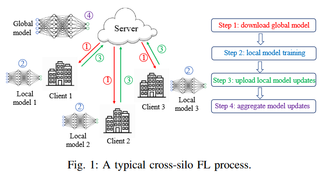
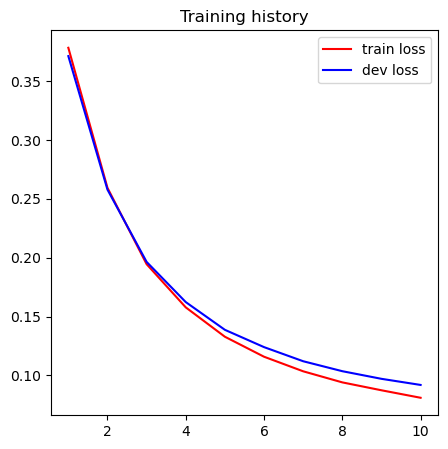

# Introduction to Federated Learning

```python
import torch
from torchvision.datasets import MNIST
from torch.utils.data import random_split, DataLoader
import torchvision.transforms as transforms

import matplotlib.pyplot as plt

from tqdm import tqdm

%matplotlib inline
plt.rcParams['figure.figsize'] = [5, 5]
```

## Load dataset


```python
train_dataset = MNIST('/kaggle/working', train=True, download=True, transform=transforms.ToTensor())
test_dataset = MNIST('/kaggle/working', train=False, download=True, transform=transforms.ToTensor())

train_dataset, dev_dataset = random_split(train_dataset, [int(len(train_dataset) * 0.83), int(len(train_dataset) * 0.17)])
```


```python
total_train_size = len(train_dataset)
total_test_size = len(test_dataset)
total_dev_size = len(dev_dataset)

classes = 10
input_dim = 784

num_clients = 8
rounds = 20
batch_size = 128
epochs_per_client = 3
learning_rate = 2e-2
```


```python
total_train_size, total_dev_size, total_test_size
```


    (49800, 10200, 10000)


## Network


```python
def get_device():
    return torch.device('cuda') if torch.cuda.is_available() else torch.device('cpu')

def to_device(data, device):
    if isinstance(data, (list, tuple)):
        return [to_device(x, device) for x in data]
    return data.to(device, non_blocking=True)

class DeviceDataLoader(DataLoader):
        def __init__(self, dl, device):
            self.dl = dl
            self.device = device

        def __iter__(self):
            for batch in self.dl:
                yield to_device(batch, self.device)

        def __len__(self):
            return len(self.dl)

device = get_device()
```


```python
class FederatedNet(torch.nn.Module):    
    def __init__(self):
        super().__init__()
        self.conv1 = torch.nn.Conv2d(1, 20, 7)
        self.conv2 = torch.nn.Conv2d(20, 40, 7)
        self.maxpool = torch.nn.MaxPool2d(2, 2)
        self.flatten = torch.nn.Flatten()
        self.linear = torch.nn.Linear(2560, 10)
        self.non_linearity = torch.nn.functional.relu
        self.track_layers = {'conv1': self.conv1, 'conv2': self.conv2, 'linear': self.linear}
    
    def forward(self, x_batch):
        out = self.conv1(x_batch)
        out = self.non_linearity(out)
        out = self.conv2(out)
        out = self.non_linearity(out)
        out = self.maxpool(out)
        out = self.flatten(out)
        out = self.linear(out)
        return out
    
    def get_track_layers(self):
        return self.track_layers
    
    # i.e update global parameters from the averaged ones 
    def apply_parameters(self, parameters_dict):
        with torch.no_grad():
            for layer_name in parameters_dict:
                self.track_layers[layer_name].weight.data *= 0
                self.track_layers[layer_name].bias.data *= 0
                self.track_layers[layer_name].weight.data += parameters_dict[layer_name]['weight']
                self.track_layers[layer_name].bias.data += parameters_dict[layer_name]['bias']
    
    def get_parameters(self):
        parameters_dict = dict()
        for layer_name in self.track_layers:
            parameters_dict[layer_name] = {
                'weight': self.track_layers[layer_name].weight.data, 
                'bias': self.track_layers[layer_name].bias.data
            }
        return parameters_dict
    
    def batch_accuracy(self, outputs, labels):
        with torch.no_grad():
            _, predictions = torch.max(outputs, dim=1)
            return torch.tensor(torch.sum(predictions == labels).item() / len(predictions))
    
    def _process_batch(self, batch):
        images, labels = batch
        outputs = self(images)
        loss = torch.nn.functional.cross_entropy(outputs, labels)
        accuracy = self.batch_accuracy(outputs, labels)
        return (loss, accuracy)
    
    def fit(self, dataset, epochs, lr, batch_size=128, opt=torch.optim.SGD, verb=0):
        dataloader = DeviceDataLoader(DataLoader(dataset, batch_size, shuffle=True), device)
        optimizer = opt(self.parameters(), lr)
        history = []
        for epoch in tqdm(range(epochs), ascii=True, desc="Epoch {}".format(epoch)):
            losses = []
            accs = []
            for batch in dataloader:
                loss, acc = self._process_batch(batch)
                loss.backward()
                optimizer.step()
                optimizer.zero_grad()
                loss.detach()
                losses.append(loss)
                accs.append(acc)
            avg_loss = torch.stack(losses).mean().item()
            avg_acc = torch.stack(accs).mean().item()
            history.append((avg_loss, avg_acc))
            if verb > 0: 
                print('Epoch {} avg_loss : {}, avg_acc : {}'.format(epoch + 1, avg_loss, avg_acc))
        return history
    
    def evaluate(self, dataset, batch_size=128):
        dataloader = DeviceDataLoader(DataLoader(dataset, batch_size), device)
        losses = []
        accs = []
        with torch.no_grad():
            for batch in dataloader:
                loss, acc = self._process_batch(batch)
                losses.append(loss)
                accs.append(acc)
        avg_loss = torch.stack(losses).mean().item()
        avg_acc = torch.stack(accs).mean().item()
        return (avg_loss, avg_acc)
```

# General sum Model 

Summing all the available dataset into a single dataset. 


```python
def sum_model_train():
    sum_model = to_device(FederatedNet(), device)

    train_history = sum_model.fit(train_dataset, 3*10, learning_rate, batch_size, verb=1)
    #print('Loss = {}, Accuracy = {}'.format(round(train_history[-1][0], 4), round(train_history[-1][1], 4)))

    dev_loss, dev_acc = sum_model.evaluate(dev_dataset)
    print('dev_loss = {}, dev_acc = {}\n'.format(round(dev_loss, 4), round(dev_acc, 4)))
    
    return train_history

sum_model_train()
```

    100%|██████████| 390/390 [00:23<00:00, 16.47it/s]
    

    Epoch 0 avg_loss : 0.6092694997787476, avg_acc : 0.8249399065971375
    

    100%|██████████| 390/390 [00:24<00:00, 16.11it/s]
    

    Epoch 1 avg_loss : 0.1815676987171173, avg_acc : 0.9473557472229004
    

    100%|██████████| 390/390 [00:23<00:00, 16.32it/s]
    

    Epoch 2 avg_loss : 0.12428489327430725, avg_acc : 0.963942289352417
    

    100%|██████████| 390/390 [00:23<00:00, 16.41it/s]
    

    Epoch 3 avg_loss : 0.09854010492563248, avg_acc : 0.9714743494987488
    

    100%|██████████| 390/390 [00:24<00:00, 15.92it/s]
    

    Epoch 4 avg_loss : 0.08470989018678665, avg_acc : 0.9753004908561707
    

    100%|██████████| 390/390 [00:24<00:00, 15.98it/s]
    

    Epoch 5 avg_loss : 0.07523505389690399, avg_acc : 0.9778445363044739
    

    100%|██████████| 390/390 [00:24<00:00, 15.90it/s]
    

    Epoch 6 avg_loss : 0.06897250562906265, avg_acc : 0.9797075390815735
    

    100%|██████████| 390/390 [00:23<00:00, 16.32it/s]
    

    Epoch 7 avg_loss : 0.0635882243514061, avg_acc : 0.981370210647583
    

    100%|██████████| 390/390 [00:23<00:00, 16.29it/s]
    

    Epoch 8 avg_loss : 0.05792345851659775, avg_acc : 0.9825119972229004
    

    100%|██████████| 390/390 [00:24<00:00, 16.20it/s]
    

    Epoch 9 avg_loss : 0.05358882620930672, avg_acc : 0.9839743375778198
    

    100%|██████████| 390/390 [00:24<00:00, 15.69it/s]
    

    Epoch 10 avg_loss : 0.05070085823535919, avg_acc : 0.9849759340286255
    

    100%|██████████| 390/390 [00:25<00:00, 15.03it/s]
    

    Epoch 11 avg_loss : 0.0482950396835804, avg_acc : 0.9851762652397156
    

    100%|██████████| 390/390 [00:25<00:00, 15.44it/s]
    

    Epoch 12 avg_loss : 0.046063803136348724, avg_acc : 0.9859575033187866
    

    100%|██████████| 390/390 [00:25<00:00, 15.42it/s]
    

    Epoch 13 avg_loss : 0.042952582240104675, avg_acc : 0.9878805875778198
    

    100%|██████████| 390/390 [00:24<00:00, 15.84it/s]
    

    Epoch 14 avg_loss : 0.04087304323911667, avg_acc : 0.9872796535491943
    

    100%|██████████| 390/390 [00:25<00:00, 15.10it/s]
    

    Epoch 15 avg_loss : 0.038987889885902405, avg_acc : 0.9883813858032227
    

    100%|██████████| 390/390 [00:25<00:00, 15.48it/s]
    

    Epoch 16 avg_loss : 0.03702929988503456, avg_acc : 0.9884214997291565
    

    100%|██████████| 390/390 [00:25<00:00, 15.27it/s]
    

    Epoch 17 avg_loss : 0.035422712564468384, avg_acc : 0.9893629550933838
    

    100%|██████████| 390/390 [00:25<00:00, 15.01it/s]
    

    Epoch 18 avg_loss : 0.033590756356716156, avg_acc : 0.9896434545516968
    

    100%|██████████| 390/390 [00:25<00:00, 15.41it/s]
    

    Epoch 19 avg_loss : 0.03288261219859123, avg_acc : 0.9896233677864075
    

    100%|██████████| 390/390 [00:25<00:00, 15.12it/s]
    

    Epoch 20 avg_loss : 0.04045133665204048, avg_acc : 0.9889423251152039
    

    100%|██████████| 390/390 [00:25<00:00, 15.18it/s]
    

    Epoch 21 avg_loss : 0.03064712882041931, avg_acc : 0.9909855723381042
    

    100%|██████████| 390/390 [00:25<00:00, 15.53it/s]
    

    Epoch 22 avg_loss : 0.0291324220597744, avg_acc : 0.9908252954483032
    

    100%|██████████| 390/390 [00:25<00:00, 15.33it/s]
    

    Epoch 23 avg_loss : 0.02733297273516655, avg_acc : 0.9917267560958862
    

    100%|██████████| 390/390 [00:24<00:00, 15.61it/s]
    

    Epoch 24 avg_loss : 0.026423955336213112, avg_acc : 0.9918269515037537
    

    100%|██████████| 390/390 [00:25<00:00, 15.54it/s]
    

    Epoch 25 avg_loss : 0.02541182190179825, avg_acc : 0.9923678040504456
    

    100%|██████████| 390/390 [00:26<00:00, 14.81it/s]
    

    Epoch 26 avg_loss : 0.024825140833854675, avg_acc : 0.9921674728393555
    

    100%|██████████| 390/390 [00:25<00:00, 15.36it/s]
    

    Epoch 27 avg_loss : 0.025470513850450516, avg_acc : 0.9921674728393555
    

    100%|██████████| 390/390 [00:25<00:00, 15.46it/s]
    

    Epoch 28 avg_loss : 0.0229304451495409, avg_acc : 0.9927283525466919
    

    100%|██████████| 390/390 [00:24<00:00, 15.88it/s]
    

    Epoch 29 avg_loss : 0.02286849170923233, avg_acc : 0.993088960647583
    Loss = 0.0229, Accuracy = 0.9931
    dev_loss = 0.0511, dev_acc = 0.9861
    
    


    [(0.6092694997787476, 0.8249399065971375),
     (0.1815676987171173, 0.9473557472229004),
     (0.12428489327430725, 0.963942289352417),
     (0.09854010492563248, 0.9714743494987488),
     (0.08470989018678665, 0.9753004908561707),
     (0.07523505389690399, 0.9778445363044739),
     (0.06897250562906265, 0.9797075390815735),
     (0.0635882243514061, 0.981370210647583),
     (0.05792345851659775, 0.9825119972229004),
     (0.05358882620930672, 0.9839743375778198),
     (0.05070085823535919, 0.9849759340286255),
     (0.0482950396835804, 0.9851762652397156),
     (0.046063803136348724, 0.9859575033187866),
     (0.042952582240104675, 0.9878805875778198),
     (0.04087304323911667, 0.9872796535491943),
     (0.038987889885902405, 0.9883813858032227),
     (0.03702929988503456, 0.9884214997291565),
     (0.035422712564468384, 0.9893629550933838),
     (0.033590756356716156, 0.9896434545516968),
     (0.03288261219859123, 0.9896233677864075),
     (0.04045133665204048, 0.9889423251152039),
     (0.03064712882041931, 0.9909855723381042),
     (0.0291324220597744, 0.9908252954483032),
     (0.02733297273516655, 0.9917267560958862),
     (0.026423955336213112, 0.9918269515037537),
     (0.02541182190179825, 0.9923678040504456),
     (0.024825140833854675, 0.9921674728393555),
     (0.025470513850450516, 0.9921674728393555),
     (0.0229304451495409, 0.9927283525466919),
     (0.02286849170923233, 0.993088960647583)]


# Client

### Cross-silo vs Cross-device FL

__Cross-Silo__ : becomes relevant when there is a limited, albeit sizeable range (for instance, anywhere between two to a
hundred) of participating entities like corporations or institutions (such as __hospitals__ and schools) that engage in learning
by training a model on their local data.


__Cross-Data__ : This configuration involves a multitude of small, geographically distributed devices, such as smartphones,
smartwatches, and edge devices. The quantity of these devices can reach up to millions, each possessing a comparatively
small amount of data and lower computational capabilities relative to the cross-silo FL paradigm.


This MNIST example is more like Cross-Data setting 


```python
class Client:
    def __init__(self, client_id, dataset):
        self.client_id = client_id
        self.dataset = dataset
    
    def get_dataset_size(self):
        return len(self.dataset)
    
    def get_client_id(self):
        return self.client_id
    
    def train(self, parameters_dict):
        net = to_device(FederatedNet(), device)
        net.apply_parameters(parameters_dict)
        train_history = net.fit(self.dataset, epochs_per_client, learning_rate, batch_size)
        print('{}: Loss = {}, Accuracy = {}'.format(self.client_id, round(train_history[-1][0], 4), round(train_history[-1][1], 4)))
        return net.get_parameters() # gradients 
```

### setup clients


```python
examples_per_client = total_train_size // num_clients

client_datasets = random_split(train_dataset, [min(i + examples_per_client, 
           total_train_size) - i for i in range(0, total_train_size, examples_per_client)])

clients = [Client('client_' + str(i), client_datasets[i]) for i in range(num_clients)]
clients 
```


    [<__main__.Client at 0x23116f551d0>,
     <__main__.Client at 0x23113d5c690>,
     <__main__.Client at 0x231173e9b90>,
     <__main__.Client at 0x231173e9ad0>,
     <__main__.Client at 0x231173e9d50>,
     <__main__.Client at 0x231173e84d0>,
     <__main__.Client at 0x231173e9ed0>,
     <__main__.Client at 0x231173ea550>]


# Federated Learning



### The general Federated Learning algorithm: 

```math
\begin{align*} 
    \min_{w\in\mathcal{R}^d} f(w) \;\;\;\;\; \text{where} \;\;\;\;\; f(w) \triangleq \frac{1}{n} \sum_{i=1}^n f_i(w)
\end{align*}
```
in ml, typically $f_i(w) = loss(x_i,y_i,w)$,  in this notebook $loss$ is **cross entropy**


We assume there are K clients over which the data is partitioned, with $P_k$ the set of indexes of data points on client k, with $n_k = |P_k|$. Thus, we can re-write the objective  as 
```math
\begin{align*}
    f(w) = \sum_{k=1}^{K} \frac{n_k}{n} F_k(w)  \;\;\;\;\; \text{where} \;\;\;\;\; F_k(w) = \frac{1}{n_k} \sum_{i \in P_k} f_i(w)
\end{align*}
```

### FedAveraging 
$\eta$ = learning rate, 
each client $k$ computes $g_k = \nabla F_k(w_t)$ the average gradient on its local data at the current model $w_t$, and the central server aggregates these gradients and applies the update : 

```math
\begin{align*}
    \forall k\;, w_{t+1}^k \leftarrow w_t - \eta g_k  \;\;\;\; \text{then} \;\;\;\; w_{t+1} \leftarrow \sum_{k=1}^K \frac{n_k}{n} w_{t+1}^k 
\end{align*}
```

That is, each client locally takes one step of gradient descent on the current model using its local data, and the server then takes a weighted average of the resulting models.


```python
def FedAvg():
    # Create global model, same architecture as the ones used on the clients.
    global_net = to_device(FederatedNet(), device)

    history = []
    for i in range(rounds):
        print('Start Round {} ...'.format(i + 1))
        curr_parameters = global_net.get_parameters()
        new_parameters = dict([(layer_name, {'weight': 0, 'bias': 0}) for layer_name in curr_parameters])

        for client in clients:
            # client update 
            client_parameters = client.train(curr_parameters) # w^k_t+1 <- w_t - \eta g_k

            # FedAvg aggregation 
            fraction = client.get_dataset_size() / total_train_size # n_k / n 
            for layer_name in client_parameters:
                new_parameters[layer_name]['weight'] += fraction * client_parameters[layer_name]['weight'] #  sum n_k / n w^k_t+1
                new_parameters[layer_name]['bias'] += fraction * client_parameters[layer_name]['bias']     # 

        global_net.apply_parameters(new_parameters) # w_t+1 <- sum n_k / n w^k_t+1

        train_loss, train_acc = global_net.evaluate(train_dataset)
        dev_loss, dev_acc = global_net.evaluate(dev_dataset)

        print('After round {}, train_loss = {}, dev_loss = {}, dev_acc = {}\n'.format(i + 1, round(train_loss, 4), 
                round(dev_loss, 4), round(dev_acc, 4)))
        
        history.append((train_loss, dev_loss))
    return history

hist = FedAvg()
```

    Start Round 1 ...
    

    100%|██████████| 49/49 [00:03<00:00, 16.26it/s]
    100%|██████████| 49/49 [00:02<00:00, 16.57it/s]
    100%|██████████| 49/49 [00:03<00:00, 16.07it/s]
    

    client_0: Loss = 0.499, Accuracy = 0.8453
    

    100%|██████████| 49/49 [00:03<00:00, 15.68it/s]
    100%|██████████| 49/49 [00:03<00:00, 15.17it/s]
    100%|██████████| 49/49 [00:03<00:00, 15.38it/s]
    

    client_1: Loss = 0.4883, Accuracy = 0.8502
    

    100%|██████████| 49/49 [00:03<00:00, 15.13it/s]
    100%|██████████| 49/49 [00:03<00:00, 15.40it/s]
    100%|██████████| 49/49 [00:03<00:00, 15.95it/s]
    

    client_2: Loss = 0.5066, Accuracy = 0.8416
    

    100%|██████████| 49/49 [00:03<00:00, 16.19it/s]
    100%|██████████| 49/49 [00:03<00:00, 15.86it/s]
    100%|██████████| 49/49 [00:03<00:00, 16.20it/s]
    

    client_3: Loss = 0.4871, Accuracy = 0.8542
    

    100%|██████████| 49/49 [00:03<00:00, 15.92it/s]
    100%|██████████| 49/49 [00:03<00:00, 16.11it/s]
    100%|██████████| 49/49 [00:03<00:00, 15.85it/s]
    

    client_4: Loss = 0.4771, Accuracy = 0.8557
    

    100%|██████████| 49/49 [00:03<00:00, 15.66it/s]
    100%|██████████| 49/49 [00:03<00:00, 15.48it/s]
    100%|██████████| 49/49 [00:03<00:00, 15.17it/s]
    

    client_5: Loss = 0.5046, Accuracy = 0.8411
    

    100%|██████████| 49/49 [00:03<00:00, 15.98it/s]
    100%|██████████| 49/49 [00:03<00:00, 15.87it/s]
    100%|██████████| 49/49 [00:03<00:00, 15.90it/s]
    

    client_6: Loss = 0.503, Accuracy = 0.8483
    

    100%|██████████| 49/49 [00:03<00:00, 15.86it/s]
    100%|██████████| 49/49 [00:03<00:00, 15.36it/s]
    100%|██████████| 49/49 [00:03<00:00, 15.20it/s]
    

    client_7: Loss = 0.5087, Accuracy = 0.8411
    After round 1, train_loss = 0.4013, dev_loss = 0.3922, dev_acc = 0.8875
    
    Start Round 2 ...

    .......................................
    
    Start Round 20 ...
    

    100%|██████████| 49/49 [00:02<00:00, 16.86it/s]
    100%|██████████| 49/49 [00:02<00:00, 16.73it/s]
    100%|██████████| 49/49 [00:02<00:00, 16.49it/s]
    

    client_0: Loss = 0.0492, Accuracy = 0.9839
    

    100%|██████████| 49/49 [00:03<00:00, 16.19it/s]
    100%|██████████| 49/49 [00:02<00:00, 16.93it/s]
    100%|██████████| 49/49 [00:02<00:00, 16.46it/s]
    

    client_1: Loss = 0.0418, Accuracy = 0.9883
    

    100%|██████████| 49/49 [00:02<00:00, 16.48it/s]
    100%|██████████| 49/49 [00:02<00:00, 17.23it/s]
    100%|██████████| 49/49 [00:03<00:00, 16.01it/s]
    

    client_2: Loss = 0.0579, Accuracy = 0.9837
    

    100%|██████████| 49/49 [00:02<00:00, 16.61it/s]
    100%|██████████| 49/49 [00:02<00:00, 16.96it/s]
    100%|██████████| 49/49 [00:02<00:00, 16.53it/s]
    

    client_3: Loss = 0.0506, Accuracy = 0.9854
    

    100%|██████████| 49/49 [00:02<00:00, 16.57it/s]
    100%|██████████| 49/49 [00:03<00:00, 16.15it/s]
    100%|██████████| 49/49 [00:02<00:00, 16.58it/s]
    

    client_4: Loss = 0.0437, Accuracy = 0.9874
    

    100%|██████████| 49/49 [00:02<00:00, 16.60it/s]
    100%|██████████| 49/49 [00:02<00:00, 16.87it/s]
    100%|██████████| 49/49 [00:02<00:00, 16.86it/s]
    

    client_5: Loss = 0.0415, Accuracy = 0.9877
    

    100%|██████████| 49/49 [00:02<00:00, 16.91it/s]
    100%|██████████| 49/49 [00:03<00:00, 15.88it/s]
    100%|██████████| 49/49 [00:02<00:00, 17.22it/s]
    

    client_6: Loss = 0.054, Accuracy = 0.9843
    

    100%|██████████| 49/49 [00:02<00:00, 17.13it/s]
    100%|██████████| 49/49 [00:02<00:00, 17.01it/s]
    100%|██████████| 49/49 [00:02<00:00, 16.98it/s]
    

    client_7: Loss = 0.0516, Accuracy = 0.9851
    After round 20, train_loss = 0.0521, dev_loss = 0.0674, dev_acc = 0.9782
    
    


```python
plt.plot([i + 1 for i in range(len(history))], [history[i][0] for i in range(len(history))], color='r', label='train loss')
plt.plot([i + 1 for i in range(len(history))], [history[i][1] for i in range(len(history))], color='b', label='dev loss')
plt.legend()
plt.title('Training history')
plt.show()
```


    

    


# $\delta$-accuracy loss 

Lets, respectively denote the accuracy's 
```math 
    \mathcal{V}_{sum}, \mathcal{V}_{fed}.
```

Let $\delta \in \mathbb{R}_+$, if 

```math
\begin{align}
    | \mathcal{V}_{fed} - \mathcal{V}_{sum} | < \delta
\end{align} 
````
we say the fl alg has $\delta$-accuracy loss.
```math

\mathcal{V}_{M_{sum}} = 0.9861 \;\;\;\;\; \mathcal{V}_{M_{fed}} = 0.9782
 
```

and 

```math
  | \mathcal{V}_{fed} - \mathcal{V}_{sum} |  = | 0.9782 - 0.9861 | =  0.0079 < 0.01 
```

Thus our FL alg has 0.01-accuracy loss


# References

> [Communication-Efficient Learning of Deep Networks from Decentralized Data](https://arxiv.org/abs/1602.05629)    
> [Federated Learning, concept and applications](https://arxiv.org/abs/1902.04885)  
> [Cross-Silo Federated Learning: Challenges and Opportunities](https://arxiv.org/abs/2206.12949)   

